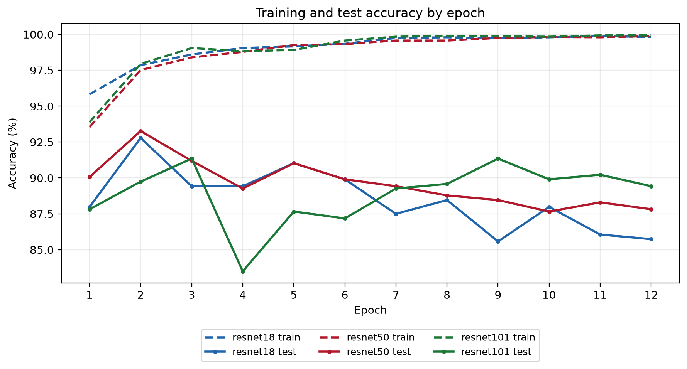
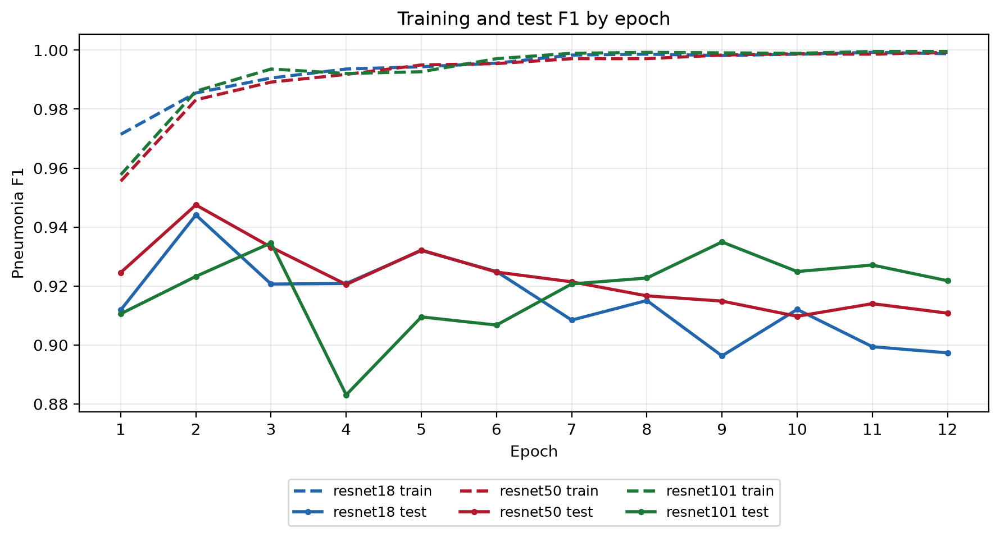
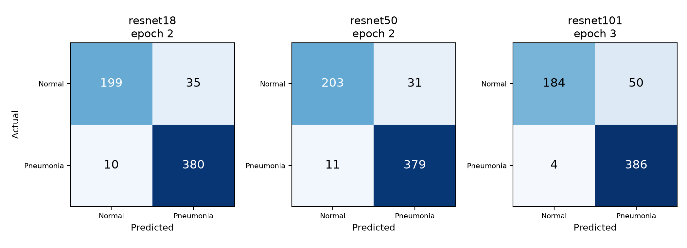

# Lab 1 胸部 X 光肺炎分類

**學號：315553010　姓名：楊敦傑**

GitHub：[Fergus4506/LAB1_315553010_---](https://github.com/Fergus4506/LAB1_315553010_---)

使用自訂 PyTorch Dataset／DataLoader，比較 ImageNet 預訓練 ResNet18、ResNet50 與 ResNet101，將胸部 X 光影像分類為 NORMAL（0）或 PNEUMONIA（1）。三個模型均以 Python 內建 `venv` 環境完成 12 輪 CUDA GPU 訓練。

**本次正式實驗結果位於 [`result/`](result/)。** 各模型依最高驗證集肺炎 F1 保存權重；按相同準則跨模型選出的 ResNet101，測試 accuracy 為 **89.26%**、F1 為 **0.9207**。逐輪觀察到的最高測試 accuracy 則為 ResNet50 的 **93.27%**，兩者代表不同的評估方式。

## 專案結構

```text
.
├── README.md                       建置、重現步驟與結果解讀
├── requirements.txt                實驗使用的非 PyTorch 套件版本
├── download_data.py                下載固定版本並擷取唯一影像
├── verify_dataset_source.py        核對官方 ZIP 與本機影像
├── split_dataset.py                建立分組切分並檢查跨區重疊
├── train.py                        自訂資料載入、GPU 訓練及逐輪紀錄
├── run_corrected_experiments.py     三模型訓練與結果稽核入口
├── compare_models.py               比較圖與成績彙整
├── verify_pretrained.py            核對預訓練權重來源及二類輸出
├── audit_corrected_experiment.py    核對指標、選模及重新評估權重
├── inference.py                    單張影像推論
├── LAB1_315553010_楊敦傑.docx         實驗報告
└── result/                         本次正式實驗紀錄
    ├── summary.json                驗證選模成績與最高觀察測試值
    ├── run_metadata.json           原實驗環境與訓練設定
    ├── epoch_metrics.csv           三模型共 36 筆逐輪指標
    ├── combined_epoch_metrics.csv  繪圖使用的彙整指標
    ├── split_manifest.json         5856 張影像的分組與雜湊
    ├── source_verification_summary.json
    ├── split_diagnosis.json
    ├── audit_corrected.json        保存權重的 GPU 重評估紀錄
    ├── pretrained_verification.json
    ├── experiment_completed.json  訓練與稽核完成狀態
    ├── training.log               三模型完整訓練日誌
    └── comparison_*.png            曲線與混淆矩陣
```

下載資料會建立 `data/`。原始影像、虛擬環境及 `.pt` 權重不納入 Git，取得專案後請依下列步驟重新產生。`result/` 的圖表、CSV、JSON 與日誌可直接閱讀。

## 資料來源與切分

資料來源：[Kaggle Chest X Ray Images Pneumonia](https://www.kaggle.com/datasets/paultimothymooney/chest-xray-pneumonia)，下載工具固定使用**第 2 版**。

官方 ZIP 中有重複的巢狀目錄及 macOS 資源檔。程式只擷取唯一的 `train|val|test / NORMAL|PNEUMONIA / image` 影像，共 **5856 張**；本次逐檔核對相對路徑、大小與 CRC32 均相符。資料卡文字的 5863 張與可下載的唯一影像數不同。

### 分組方式

原始資料有 30 組檔案完全相同的影像，均位於同一官方分區；解碼像素檢查同樣得到 30 組，兩個數量不可相加。先前以單張影像切出驗證集，使 9 組相同影像跨訓練與驗證。正式結果已改用分組切分並重訓全部模型：

- 以檔名組、檔案 SHA256、解碼 RGB 尺寸與像素 SHA256 建立連通分組，整組分配。
- 肺炎檔名組包含 `person編號_bacteria` 或 `person編號_virus`；正常影像依 `IM-序號` 或 `NORMAL2-IM-序號` 分組。
- 固定種子 `315553010`，從官方 train 依類別選約 15% 作驗證，官方 val 全部加入驗證；官方 test 保持原樣。
- 原始重複影像保留在同一分區，不刪除影像。

| 分區 | NORMAL | PNEUMONIA | 合計 |
| --- | ---: | ---: | ---: |
| 訓練 | 1140 | 3294 | 4434 |
| 驗證 | 209 | 589 | 798 |
| 測試 | 234 | 390 | 624 |

正式切分的檔名組、檔案雜湊、像素雜湊及連通分組跨區重疊皆為 **0**。訓練前會再次核對影像雜湊、影像清單及官方測試成員。這不等於已證明病患完全獨立：資料缺乏可核實的臨床病患識別碼，也尚未排除所有近似影像。

## 模型與共同設定

### 為何選擇這三種 ResNet

ResNet 的殘差捷徑讓特徵可經捷徑傳遞，便於比較不同深度的網路。ResNet18 提供參數較少的基準；ResNet50 以 bottleneck 區塊提供中間容量；ResNet101 大幅增加深度，用來檢查更大容量是否帶來可觀察收益。較大模型也增加參數儲存與運算需求，因此需要同時比較成績及成本。

| 模型 | 區塊 | 四個 stage 的區塊數 | 二類總參數 | 可訓練參數 | 預訓練權重 |
| --- | --- | --- | ---: | ---: | --- |
| ResNet18 | BasicBlock | 2／2／2／2 | 11,177,538 | 10,494,466 | IMAGENET1K_V1 |
| ResNet50 | Bottleneck | 3／4／6／3 | 23,512,130 | 22,067,202 | IMAGENET1K_V2 |
| ResNet101 | Bottleneck | 3／4／23／3 | 42,504,258 | 41,059,330 | IMAGENET1K_V2 |

三者均**使用 pretrained model**，最後 `fc` 重新初始化為二類輸出。凍結 `conv1`、`bn1`、`layer1`、`layer2`，維持凍結區段 BatchNorm 為 eval；只微調 `layer3`、`layer4`、`fc`。預訓練提供已有的影像特徵，凍結前段則限制更新範圍。本次沒有從零訓練對照，不能量化預訓練帶來多少改善；V1 與 V2 的差別也使模型間差異無法完全歸因於深度。

### 資料載入與訓練

- 輸入：224 × 224 RGB，ToTensor 後使用 ImageNet mean `[0.485, 0.456, 0.406]`、std `[0.229, 0.224, 0.225]`。
- 訓練增強：RandomAffine 旋轉 ±7°、平移最多 3%、縮放 0.95–1.05；ColorJitter 亮度及對比各 0.9–1.1 倍。驗證／測試僅縮放、轉換及正規化。
- DataLoader：batch size 32、workers 2、pin memory；僅訓練 shuffle，不丟棄最後不足一個 batch 的資料。
- 每模型 12 輪；加權交叉熵的類別權重為 `N / (2 × N_c)`。
- AdamW：learning rate `1e-4`、weight decay `1e-4`；CosineAnnealingLR `T_max=12`，CUDA float16 AMP 與 GradScaler。
- 每模型重設種子 `315553010`，停用 cuDNN benchmark、啟用 deterministic。
- 權重依**最高驗證集肺炎 F1**保存，完全同分時保留較早輪次。預測類別取 logits 的 argmax。
- F1 為 PNEUMONIA 正類的二元 F1，不是 macro F1。測試集每輪評估是作業要求，未用於本次選權重或調整超參數。

## 建置環境

需要 Python 3.12、NVIDIA GPU，以及能支援 CUDA 12.8 PyTorch wheel 的 NVIDIA 驅動。正式實驗使用 RTX 4070、Python 3.12.14、PyTorch 2.11.0+cu128、torchvision 0.26.0+cu128；其餘版本固定於 `requirements.txt`。不同硬體、驅動或套件版本可能產生數值差異。

先取得本專案，再於儲存庫根目錄執行建置步驟。以下命令均使用相對路徑，不需要特定磁碟或使用者目錄。

```bash
git clone https://github.com/Fergus4506/LAB1_315553010_---.git
cd LAB1_315553010_---
```

### Windows PowerShell

```powershell
py -3.12 -m venv .venv
$python = Join-Path (Get-Location) '.venv/Scripts/python.exe'
New-Item -ItemType Directory -Force data/temp, data/pip_cache | Out-Null
$env:TEMP = Join-Path (Get-Location) 'data/temp'
$env:TMP = $env:TEMP
$env:PIP_CACHE_DIR = Join-Path (Get-Location) 'data/pip_cache'
$env:TORCH_HOME = Join-Path (Get-Location) 'data/torch_cache'
$env:MPLCONFIGDIR = Join-Path (Get-Location) 'data/mplcache'
$env:CUDA_CACHE_PATH = Join-Path (Get-Location) 'data/cuda_cache'
$env:PYTHONIOENCODING = 'utf-8'

& $python -m pip install torch==2.11.0+cu128 torchvision==0.26.0+cu128 --index-url https://download.pytorch.org/whl/cu128
& $python -m pip install -r requirements.txt
& $python -c "import sys, torch; assert sys.prefix != sys.base_prefix; assert torch.cuda.is_available(), 'CUDA unavailable'; print(sys.executable); print(torch.__version__, torch.cuda.get_device_name(0))"
```

### Linux Bash

```bash
python3.12 -m venv .venv
python="$PWD/.venv/bin/python"
mkdir -p data/temp data/pip_cache
export TMPDIR="$PWD/data/temp"
export PIP_CACHE_DIR="$PWD/data/pip_cache"
export TORCH_HOME="$PWD/data/torch_cache"
export MPLCONFIGDIR="$PWD/data/mplcache"
export CUDA_CACHE_PATH="$PWD/data/cuda_cache"
export PYTHONIOENCODING=utf-8

"$python" -m pip install torch==2.11.0+cu128 torchvision==0.26.0+cu128 --index-url https://download.pytorch.org/whl/cu128
"$python" -m pip install -r requirements.txt
"$python" -c "import sys, torch; assert sys.prefix != sys.base_prefix; assert torch.cuda.is_available(), 'CUDA unavailable'; print(sys.executable); print(torch.__version__, torch.cuda.get_device_name(0))"
```

以上直接呼叫 venv 的 Python，不必執行 activate。訓練與權重稽核需要 CUDA；若 GPU 檢查失敗，先處理驅動或 PyTorch 安裝。下列 PowerShell 步驟在 Bash 中可將 `& $python` 改為 `"$python"`；換新終端機時，請重新設定上述 Python 變數與環境變數。

## 重現完整實驗

### 1 下載並核對資料

```powershell
& $python download_data.py --output-dir data
& $python verify_dataset_source.py
& $python split_dataset.py
```

第一次下載約 2.46 GB，需網路連線。程式使用固定版本的公開下載端點，重用已存在的 ZIP；影像放在 `data/chest_xray/`，核對紀錄與切分清單放在 `data/source_verification/`。若下載端點回傳權限、驗證頁或限流錯誤，應先處理下載問題，不要跳過來源核對。

預設切分種子與比例對應本次正式實驗。下列命令核對兩份 JSON 的完整內容，包括每張影像的分區、標籤與雜湊；不把換行字元差異誤判為切分不同：

```powershell
& $python -c "from pathlib import Path; import json; a=json.loads(Path('data/source_verification/corrected_split_manifest.json').read_text(encoding='utf-8')); b=json.loads(Path('result/split_manifest.json').read_text(encoding='utf-8')); assert a == b, 'Split manifest contents differ'; print('All split records match the reference')"
```

正式清單原始檔案 SHA256：`d2994dc03d477d7dd9b4483518110be187266553ac94eac7044cc6c6ed3183e3`。`.gitattributes` 保留 `result/split_manifest.json` 的原始位元組，避免 Git 自動轉換換行，使正式清單與保存權重、執行紀錄的雜湊一致。新環境重新生成的 JSON 可能使用不同換行，應以上述完整內容比較核對切分；新訓練會記錄該次清單自己的檔案雜湊。

### 2 訓練三個模型並核對權重

```powershell
& $python run_corrected_experiments.py --output-dir runs/reproduction_run
```

程式依序完成三模型訓練、比較圖、預訓練來源檢查，以及保存權重的 GPU 重評估；全部通過後寫入 `experiment_completed.json`。`runs/reproduction_run/` 是此次重跑的輸出，`result/` 保留正式參考結果。已有完成成績的輸出目錄會拒絕覆蓋；再次重跑請換成新的目錄名稱。

主要產物包括：

- `summary.json`、`epoch_metrics.csv`、`training.log`：分數、每輪紀錄與日誌。
- `*_best_validation.pt`：各模型依驗證 F1 保存的權重。
- `comparison_accuracy.png`、`comparison_f1.png`：訓練／測試比較曲線。
- `comparison_highest_test_confusion.png`、`comparison_final_test_confusion.png`：最高測試 accuracy 與驗證選模兩種混淆矩陣。
- `pretrained_verification.json`、`audit_corrected.json`：預訓練核對與權重重評估結果。

如需單獨重新核對這次產生的權重：

```powershell
& $python verify_pretrained.py --results-dir runs/reproduction_run
& $python audit_corrected_experiment.py --results-dir runs/reproduction_run
```

若本機已另備 `result/` 對應的三份 `.pt`，可把上述目錄改為 `result`。Git 不包含權重，僅下載儲存庫後不能直接執行正式權重重評估。

### 3 單張影像推論

```powershell
& $python inference.py --checkpoint runs/reproduction_run/resnet101_best_validation.pt --image data/chest_xray/test/NORMAL/IM-0001-0001.jpeg
```

推論優先使用 CUDA，無 CUDA 時可用 CPU，輸出預測類別及兩類 softmax 機率。請換成自己要評估的影像路徑；這些輸出是模型分類分數，未進行機率校正。

## 正式實驗結果

### 驗證 F1 選定權重後的測試表現

| 模型 | 保存輪次 | 驗證 F1 | 測試 accuracy | Precision | Recall | 測試 F1 |
| --- | ---: | ---: | ---: | ---: | ---: | ---: |
| ResNet18 | 9 | 0.9889 | 85.58% | 0.8138 | 0.9974 | 0.8963 |
| ResNet50 | 10 | 0.9880 | 87.66% | 0.8380 | 0.9949 | 0.9097 |
| ResNet101 | 7 | 0.9897 | 89.26% | 0.8549 | 0.9974 | 0.9207 |

來源：[`result/summary.json`](result/summary.json)。[`result/audit_corrected.json`](result/audit_corrected.json) 記錄全部 36 筆逐輪指標、選模規則與 GPU 重新評估；三份保存權重均重現對應輪次的驗證及測試指標。

### 逐輪最高觀察測試成績

| 模型 | 最高測試 accuracy | 最高測試 F1 | 12 輪整段耗時 |
| --- | ---: | ---: | ---: |
| ResNet18 | 92.79%　第 2 輪 | 0.9441　第 2 輪 | 522.8 秒 |
| ResNet50 | 93.27%　第 2 輪 | 0.9475　第 2 輪 | 522.6 秒 |
| ResNet101 | 91.35%　第 3、9 輪 | 0.9349　第 9 輪 | 524.1 秒 |

最高測試 accuracy 同分時，熱圖顯示最早輪次，所以 ResNet101 顯示第 3 輪。最高 accuracy 與最高 F1 不一定同輪。此表是作業要求的最高觀察值，沒有用來選擇保存權重；多次觀察後的最大值可能較樂觀。耗時包含資料讀取、訓練、評估、保存及繪圖，不能視為純 GPU 計算或推論速度。

### 比較圖







另可查看[驗證曲線](result/comparison_validation.png)、[驗證選模後的混淆矩陣](result/comparison_final_test_confusion.png)及[最高成績截圖](result/comparison_results_screenshot.jpg)。

## 結果解讀與改善方向

**模型深度的收益有限且取決於選模方式。** 驗證選模後，ResNet101 比 ResNet50 多判對 10 張，accuracy 增加 1.60 個百分點；但逐輪最高測試 accuracy 由 ResNet50 取得。ResNet101 參數約為 ResNet50 的 1.81 倍，尚需推論時間與記憶體量測來比較成本，且單次種子不能證明穩定優勢。

**主要問題是正常影像的假陽性。** ResNet101 的 FP／FN 為 66／1，肺炎 recall 達 99.74%，正常 specificity 為 71.79%。驗證集的正常影像為 0／209 誤判，測試集卻為 66／234；因此需要逐類別分析驗證與測試的落差，不能只看接近 0.99 的驗證 F1。正常影像比例在驗證集與測試集不同，但比例本身不足以解釋類別內假陽性率的差異。

**繼續訓練沒有持續提高測試準確率。** ResNet50 由第 2 輪到驗證選定的第 10 輪，FP 從 31 增至 75，FN 從 11 降至 2；少漏判 9 張肺炎，同時多誤判 44 張正常影像。訓練曲線接近飽和與測試表現波動，與過度擬合或分布差異相容，但本次尚無控制實驗可分離原因。

提升準確率的下一步應由錯誤分析出發：

1. 檢查假陽性影像的品質、邊框、來源與標籤，確認是否存在可驗證的分布差異。
2. 僅在分組驗證集逐項比較學習率、解凍範圍、增強幅度與類別權重，同時記錄 recall 及 specificity。
3. 如調整閾值或使用早停，仍以驗證集決定；不能直接把測試最高分輪次當成早停規則。
4. 使用多個訓練種子與分組切分報告平均值及變異；有可靠病患資料後，再進行病患分組與外部資料驗證。

以上改善尚未實測，不能保證提升幅度。測試結果已被逐輪觀察並用於提出這些方向；未來依此調整方法後，需要未參與決策的新資料作最終評估。

## 版本管理範圍

Git 保留訓練與稽核程式、正式結果圖表、CSV、JSON、訓練日誌及報告。`.gitignore` 排除 `.venv/`、`data/`、`runs/`、`*.pt`、Python 快取及本機封存目錄 `no_use_data/`。原實驗的 `run_metadata.json` 與日誌保留執行當時的環境資訊，程式重跑時使用目前專案位置，不依賴紀錄中的原機器路徑。

## 報告提交

可編輯報告為 `LAB1_315553010_楊敦傑.docx`。提交 E3 前應匯出成 `LAB1_315553010_楊敦傑.pdf`；報告包含 Introduction、Experiment setups、Experiment result、Discussion 與上述 GitHub 連結。作業指定截止時間為 2026 年 10 月 16 日 23:59。

## 參考資料

- [Deep Residual Learning for Image Recognition](https://arxiv.org/abs/1512.03385)
- [Torchvision ResNet API](https://docs.pytorch.org/vision/stable/models/resnet.html)
- [Kaggle Chest X Ray Images Pneumonia](https://www.kaggle.com/datasets/paultimothymooney/chest-xray-pneumonia)
